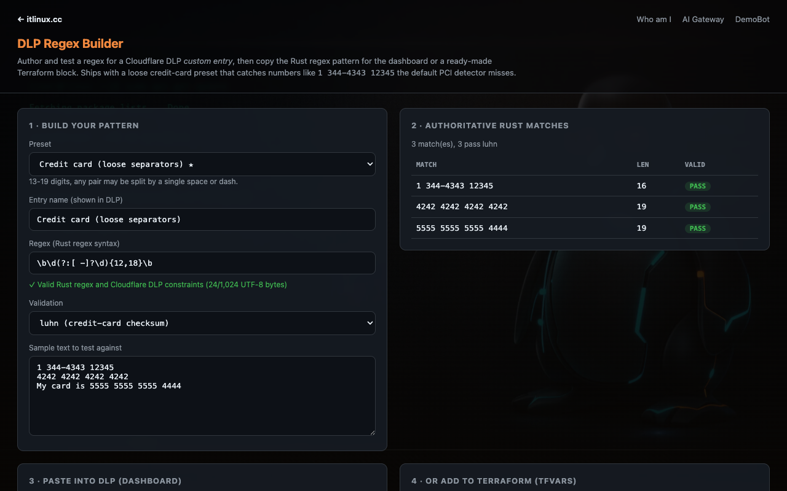
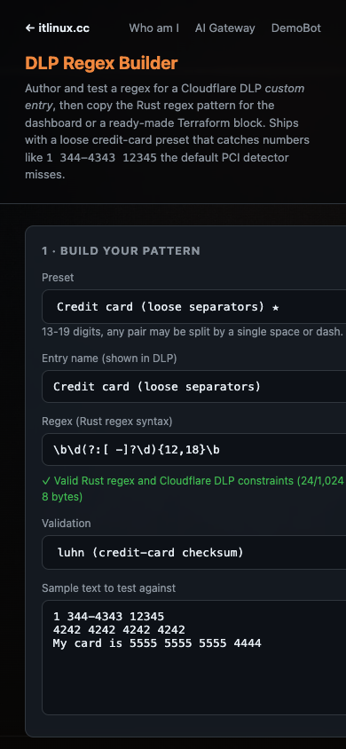

# dlp-cc-regex

A self-serve **DLP Regex Builder** (Cloudflare Worker frontend) + a **Terraform module** that deploys it alongside a Cloudflare **DLP custom profile** — built to catch credit-card numbers with *creative* formatting (e.g. `1 344-4343 12345`) that Cloudflare's default PCI detector misses.

```
┌─────────────────────────┐        ┌──────────────────────────────┐
│  Worker frontend         │  copy  │  Terraform module            │
│  (author + test regex)   ├───────▶│  DLP custom profile + entry  │
│  → Rust regex pattern    │ tfvars │  (+ optional Gateway policy) │
│  → tfvars entry          │        │                              │
└─────────────────────────┘        └──────────────────────────────┘
```

## Why

Cloudflare's built-in credit-card DLP detector expects canonically grouped
numbers (4-4-4-4). Cards typed with odd separators slip past it:

```
1 344-4343 12345   ← 13 digits, weird grouping → default detector misses it
```

DLP custom entries use **Rust regex syntax** (no lookaround, backreferences, or
checksum). So we split the job:

1. **Rust regex** in the DLP entry — matches 13–19 digits where any pair may
   be separated by a single space or dash:
   ```
   \b\d(?:[ -]?\d){12,18}\b
   ```
2. **Luhn** — regex cannot do it, so it is expressed as the entry's `validation`
   option. The Worker performs the authoritative Rust regex match first, then
   applies the Luhn post-filter to each matched substring.

## Two parts, one repo

### 1. Worker frontend — `src/index.js`
A dark self-serve page where a customer:
- picks a categorized **high-confidence preset** or **Custom** and sees the preset's detection note,
- tests it live against sample text,
- uses Rust regex 1.13.1 compiled to WebAssembly for authoritative validation and matching,
- sees Cloudflare's 1,024-byte and bounded-quantifier constraints separately,
- displays match text and offsets returned by the Rust engine,
- optionally runs **Luhn** validation on matches,
- **copies** either the raw regex (for the dashboard) or a ready-made `dlp_custom_entries` tfvars object.

The catalog deliberately favors recognizable prefixes and bounded assignment
contexts over generic `secret=...` matching. Generic assignments are excluded:
they are too noisy for a high-confidence production posture. Several regexes
consume an allowed trailing delimiter because Rust regex has no lookaround; the
note shown for each preset calls this out where relevant.

#### Preset catalog

| Category | Presets |
|---|---|
| Financial data | Credit card (loose separators) ★; Credit card (canonical 4-4-4-4) |
| Cloud providers | AWS access key ID; Google API key; Google OAuth client secret; Azure Storage account key; Azure Storage shared access signature; Microsoft Entra client secret |
| Source control | Azure DevOps personal access token; GitHub classic token families; GitHub fine-grained PAT; GitLab personal access token |
| AI and API providers | OpenAI project/service-account key; OpenAI user key; Anthropic API key; Stripe live secret/restricted key |
| Messaging | Slack access token; Slack incoming webhook URL |
| Credentials and infrastructure | PEM private-key header; compact JWT; authenticated HTTP(S) URL; database URL with credentials |
| Custom | Custom (write your own) |

#### HTTP contract and limits

| Endpoint | Method | Purpose |
|---|---|---|
| `/` | `GET` | Builder UI |
| `/health` | `GET` | Plain `ok` health response |
| `/api?regex=&text=&validation=` | `GET` | Curl-friendly scan |
| `/scan` | `POST` | JSON scan API |

Known paths reject unsupported methods with `405` and `Allow`; unknown paths
return `404`. `/scan` requires a JSON object and rejects malformed JSON, null,
arrays, and non-JSON content. Limits are **128 KiB request body**, **1,024 UTF-8
bytes regex**, **64 KiB sample text**, and **256 UTF-8 bytes entry name**.
`validation` is only `none` or `luhn`; `flags` is only `g`. Matching always uses
the bounded Rust Wasm scanner. Case/multiline/dotall behavior must be expressed as
inline Rust flags in the DLP pattern, for example `(?i:foo)`.

Local dev:
```bash
npm run dev     # local-only: http://localhost:8799 (no Terraform or CF credentials)
npm test        # catalog, API limits/routes, HTML script/ID, Rust/Wasm, and Luhn checks
./scripts/build-regex-validator.sh  # reproducible Docker Wasm build
npm run dev:remote                  # optional remote dev session; requires CF auth
npx --yes wrangler@4.131.1 deploy --dry-run  # package without publishing
```

The local builder is stateless and includes the committed Rust/WASM validator.
Terraform is not needed for local development; use it only for Cloudflare
infrastructure or production deployment.

## Sales and customer-demo quick start

The public builder is ready to use without installing anything:

**Open:** <https://dlp-regex.itlinux.cc/>

Use it to demonstrate:

1. Choose a provider preset, such as **AWS access key ID**, **Google API key**, or
   **Azure Storage SAS**.
2. Review the detection note and synthetic sample text.
3. Paste customer-safe sample text into the test area.
4. Show the authoritative Rust validation result and matches.
5. Copy the Rust regex or Terraform entry when the customer is ready to deploy.

The live demo does not require a customer account or Terraform. Do not paste real
customer credentials into the public demo; use synthetic values or the included
samples.

### Customer deployment prerequisites

The demo and the customer deployment are separate. A customer who wants to ship a
rule into their own Cloudflare account will need:

- A Cloudflare account with Zero Trust/DLP enabled.
- Their Cloudflare account ID and the target Zero Trust configuration.
- A Cloudflare API token with the minimum required permissions for their chosen
  workflow: **Account → Zero Trust → Edit** for DLP/Gateway configuration and,
  when deploying the Worker, **Account → Workers Scripts → Edit**.
- Their organization's approval to inspect the intended traffic and enable TLS
  inspection/Gateway enforcement where required.

Never paste the API token into the public demo or commit it to Git. The customer
should create and store it in their own secret manager or deployment environment.
The `terraform` branch contains the infrastructure deployment path; the `local`
branch is the sales/demo builder only.

### Local development

This section is for engineers maintaining the tool, not for sales demos. It
requires a Node.js development environment, although it does not require a
Cloudflare account for local-only mode:

```bash
npm install
npm run dev
```

For the Terraform-backed Cloudflare deployment, switch to the `terraform` branch.

## Creating a pattern locally

1. Open the local builder with `npm run dev`, or use the public demo at
   <https://dlp-regex.itlinux.cc/>.
2. Choose a preset or select **Custom**.
3. Test the pattern against customer-safe sample text.
4. Copy the validated Rust regex for your DLP workflow.

This `local` branch does not require Terraform. The Terraform export and
deployment workflow are available on the `terraform` branch.

## Live preview

The builder is live at [dlp-regex.itlinux.cc](https://dlp-regex.itlinux.cc/).
The screenshots below were captured from the deployed Worker at desktop and mobile widths.





## Files
```
src/index.js                     Worker (frontend + scan API)
src/regex-validator.js           Wasm ABI + Cloudflare constraints
src/regex_validator.wasm         generated Rust regex validator
rust-regex-validator/            pinned Rust source and Cargo lock
scripts/build-regex-validator.sh Docker-based reproducible build
test/*.test.mjs                  catalog, scan, Rust validation, and Luhn tests
wrangler.toml, package.json      Worker dev/deploy
```
